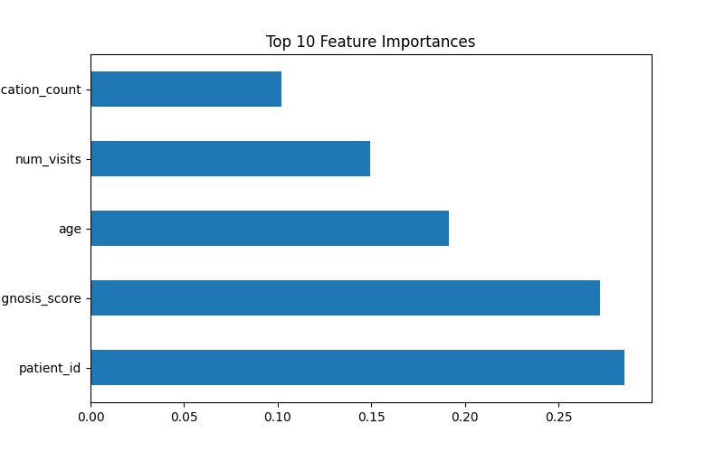

# 🩺 Patient Readmission Prediction (Machine Learning Project)

This project uses a Machine Learning model to predict **hospital patient readmission** based on demographic and clinical factors such as age, blood pressure, cholesterol, and glucose levels.
It combines **Python**, **Scikit-learn**, and **Matplotlib** to train, evaluate, and visualize the model results.

---

## ⚙️ Technologies Used
- **Python** – for data cleaning, model training, and evaluation
- **Scikit-learn** – for machine learning algorithms (Random Forest)
- **Matplotlib & Seaborn** – for visualization (confusion matrix and feature importance)
- **Pandas & NumPy** – for data processing and feature preparation

---

## 📂 Project Structure

patient_readmission_project/
│── data/
│ └── patient_data.csv
│── scripts/
│ └── train_model.py
│── results/
│ ├── confusion_matrix.png
│ ├── feature_importance.png
│ ├── terminal_output.png
│── README.md
│── requirements.txt

---

## 🧠 Methodology

1. **Data Loading**
   The dataset `patient\_data.csv` contains patient health information.

2. **Data Preprocessing**
   - Encodes categorical features
   - Removes missing values
   - Splits data into training and testing sets

3. **Model Training**
   - Uses **Random Forest Classifier** for prediction
   - Evaluates with accuracy, recall, and ROC-AUC score

4. **Visualization & Insights**
   - Confusion Matrix → shows prediction performance
   - Feature Importance → highlights key predictive factors

---

## 📊 Results & Dashboard

| Visualization | Description |
|----------------|-------------|
|  | Model performance on test data |
|  | Top health features influencing readmission |
|  | Model accuracy and classification report |

---

## 🚀 How to Run

1. Clone or download this repository
2. Create a virtual environment and install dependencies:
   ```bash
   pip install -r requirements.txt

Run the training script:

python scripts/train_model.py

View model outputs in the /results folder

🧾 Key Learnings

Built an end-to-end machine learning pipeline
Learned how to interpret feature importance for healthcare data
Practiced building reproducible, portfolio-ready ML projects
